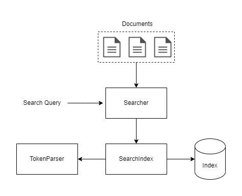

# Galileo
Super basic search engine implementation in C#, made only for educational purposes.

### Architecture
The project have 3 main parts:
- searcher responsible for executing the query and sorting the results.
- token parser that turns a list of documents into tokenized documents that can be indexed
- search index that can index a list of tokenized documents.

